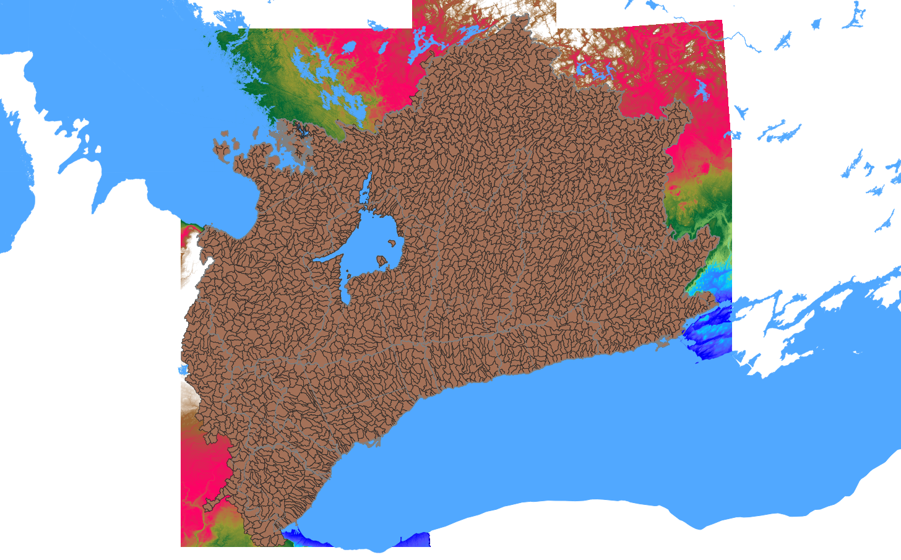

```{css, echo=FALSE}
h1, .h1, h2, .h2, h3, .h3 {
    margin-top: 84px;
}
```

```{r setup, include=FALSE}
knitr::opts_chunk$set(echo = TRUE)
library(ggplot2)
```

***

## Itemized Summary

- model run from the hydrological water year 2010 (2009-10-01) through water year 2020. 
- Potential evaporation determined using the empirical wind functions of Penman (1948)
- Rainfall was collected from capa
- Snowmelt was collected from SNODAS
- T, rh from MSC
- 12.1M x 50x50 m cells x 6-hourly ts x 10 years

## Executive Summary

The model is physically based in that mass is conserved and it is not constrained to any particular timestep. Most parameters are common, percent impervious, conductivity of surficial soils, etc.

## Introduction

The following is a description of the water budget tool located on our website, hereinafter referred to as the "*model*".

## Model Structure

Runoff is conceptualized as being generated through the saturation excess (Dunne, 1975 CHECK) mechanism. Land area that has the capacity to retain water (through interception, soil retention, depression/rill storage, etc.) must be satisfied. The saturation excess mechanism is dependent on topography and it's interaction with the groundwater system; thus the model is distributed (cell-based) and has an integrated (albeit conceptual) groundwater system.

Surface water-groundwater integration is viewed from the hydrologists' perspective: areas where is the groundwater system limiting infiltration (shallow groundwater table) and even contributing to overland runoff (springs/seepage areas). As a model output, this can be quantified as a net groundwater exchange field (groundwater recharge and discharge)


dunnian processes.


The purpose of the model is to have a 


The purpose of the model is to account for the water balance  estimate the spatial and temporal distribution of water on the landscape.


The basis of the model is that topography is paramount to the lateral movement of water yielding runoff. The model is deemed regional, in that it covers a large areal extent, yet is kept to a fine resolution to ensure that observed geomorphic flow patterns are represented in the model.


### Time stepping

The time step of the model has been set to 6 hour steps on 00:00\ UTC, yielding the local time steps of 01:00, 07:00, 13:00, and 19:00 EST. This step is chosen as it matches the received precipitation dataset described below.

### Digital Elevation Model

The Greater Toronto Area 2002 DEM (OMNRF, 2015) was re-sampled to the model's 50x50m grid cell resolution. Surface depressions were removed using Wang and Liu (2006) and flat regions were corrected using Martz (1997).

Drainage directions and flowpaths of the now "hydrologically correct" DEM were were assigned based on the direction of steepest decent (D8).Cell gradients ($b$) and slope aspects were calculated based on a 9-cell planar interpolation routine. The unit contributing area $a=A/w$ topographic wetness index $ln\frac{a}{\tan b}$ (Beven and Kirkby, 1979--CHECK) were computed for every cell.

### Sub-basins

The 30,000 km² model area has been sub divided into 2,813 approximately 10 km² sub-basins. Within these sub-basins:
1. Meteorological forcings from external sources are aggregated applied uniformly within the sub-basin (via a pre-processing routine); and
1. Local shallow water response is assumed to act uniformly (the shallow subsurface catchment area).


```{r fig.sws, echo=FALSE, fig.align = 'center', out.width = "75%", fig.cap = "2,813 10km² subwatersheds delineated within the ORMGP jurisdicton."}
knitr::include_graphics(here::here("fig", "fig-sws1.png"))
```

<!-- <center> -->
<!--  -->
<!-- </center> -->

### Parameterization

Although a distributed model, the procedures applied at the cell scale are quite parsimonious. There is no separate treatment of interception, depression storage, nor soil water retention, rather it is assumed that these processes respond to environmental factors (e.g., evaporation) in parallel and thus can be treated in bulk.

From the top down perspective, viewing some 12.1 million 50x50m cells covering 30,000 km², it seems rather overcomplicated (possibly frivolous) to account water any more than to total mass present at any particular (lateral) location.

#### Global parameters

Cells with a contributing area ($A$) greater than 1 km² are deemed "stream cells" in which additional sources include groundwater discharge to streams.

#### Sub-basin parameters

Groundwater processes in the model are conceptualized at the sub-basin scale and so much of the groundwater parameterization is implimented here.

#### Cell-based parameters

Each cell is classified according to (i) surficial geology and (ii) land use mapping where each class is parameterized independently. "Look-up tables" are used to distribute model parameters accordin to their classification.

##### Parameters:
- impervious fraction
- retention/storage capacity
- depression storage
- percolation rates


### Inputs

The model's structure is defined rather simply by at least 5 raster data sets. Given these data, the model's pre-processor will generate additional information based on these data:

1. digital elevation model
1. land use index (with parameter lookup table)
1. surficial geology index (with parameter lookup table)
1. 


## Model Variables

One goal set for the model design was to leverage contemporary gridded data sets available from a variety of open and public sources. Products known as "*data re-analysis products*" or "*data-assimilation products*" attempt to merge meteorological information from a variety of sources, whether they be ground (station) measurements, remote sensing observations (e.g., radar, satellite, etc.), and archived near-cast weather model outputs.  When combined, the gridded data resemble the spatial distribution of meteorological forcings unlike what can be accomplished through standard interpolation practices using point measurements (e.g., thiessen polygons, inverse distance weighting, etc.).

An advantage to the data-assimilation products is that it removes the modeller from needing to model certain processes explicitly. Here, for example, the model does not account for a snowpack, rather inputs to the model include snowmelt derrived from SNODAS.

The extent of the model combined with the resolution of the prosesses simulated lends itself best viewed from a top-down perspective (REF). This allows for model simplification by which many of the layered water stores (i.e., interception, deptression, soil, etc.) may be handled procedurally as one unit. Viewing the model domain in it's 30,000 km² extents,one can imagine how difficult it would be to discern any verticle detail.


### Model Input Data Processing

Meteorological data aquisiton, management, aggregation and interpolation was accomplished using [Delft-FEWS](https://www.deltares.nl/en/software/flood-forecasting-system-delft-fews-2/) (ver.2019.02 build.39845) a flood forecasting system offered (at no cost, only license agreement) by [Deltares](https://www.deltares.nl/en/). Configuration files for the Delft-FEWS system build can be found here: BLAH.

Climate forcing data required by the model are atmospheric yield and potential evaporation on a 6-hourly timestep. Atmospheric yield is her defined as water added to land surface in its mobile (read: liquid) form.  Additional processing performed on the data exported from Delft-FEWS is described below.


#### Data sets:

Forcings data to the model processed by FEWS include:

1. [CaPA-RDPA](https://weather.gc.ca/grib/grib2_RDPA_ps10km_e.html) 10/15km gridded precipitation fields, yielding 6-hourly precipiation totals, aquired from [CaSPAr](https://caspar-data.ca/);
1. [SNODAS](https://nsidc.org/data/g02158) (NOHRSC, 2004) ~1km gridded 24-hour (UTC 06-06) snowmelt totals; and
1. Meteorological Service of Canada (MSC) hourly mean temperature and pressure accessed [here](http://climate.weather.gc.ca/historical_data/search_historic_data_e.html).

#### Transformations

The time step of the model was set to the 6-hour time step offered with the CaPA-RDPA data. Hourly temperatures were 

#### Time step (temporal scale)

The time step of the model has been set to 6 hour steps. All other data sets have been either aggregated or disaggregated to match this temporal scale.

The aquired data come in a variety of time steps...

```{r fig.temp, echo=FALSE, fig.align = 'center', out.width = "75%", fig.cap = "discrepancy in data time resolution."}
knitr::include_graphics(here::here("fig", "met_timeline.svg"))
```


#### Interpolation (spatial scale)

Once transformed to the set time step, both scalar (i.e., point) data and gridded data are then interpolated to the 10 km² sub-watersheds. Given that each watershed contains 


### Atmospheric Yield
#### Precipitation and Snowmelt


CaSPAr

... 10 km resolution, compare that to the XX average spacing among operational meteorological stations.


snodas ... can avoid the need to model snowmelt explicitly, and leverage online resources.

<!-- The daily SNODAS time series was then disaggregated to the 6-hourly-UTC time stepping scheme described above using the Delft-FEWS transformation [Disaggregation: MeanToMean](https://publicwiki.deltares.nl/display/FEWSDOC/meanToMean). -->


The precipitation and snowmelt time-series was then projected onto the model sub-watersheds using the transformation: [InverseDistance](https://publicwiki.deltares.nl/display/FEWSDOC/InterpolationSpatialInverseDistance).


#### Atmospheric Yield


The data collected include total precipitation and snowmelt. Summing the two together would double count precipitation fallen as snow; the model, however does not account for snow, rather it relies on snowmelt as a forcing. Precipition is parsed into rainfall and snowfall on the basis of a critical temperature ($T_\text{crit}$):

$$
\text{Rainfall}=
\begin{cases}
\text{Precipitation}, & T>T_\text{crit}\\
0 & \text{otherwise},
\end{cases}
$$
$$
\text{Snowfall}=
\begin{cases}
\text{Precipitation}, & T\leq T_\text{crit}\\
0 & \text{otherwise}.
\end{cases}
$$

<!-- $$ -->
<!-- \begin{split} -->

<!-- \text{Rainfall} &= -->
<!-- \begin{cases} -->
<!-- \text{Precipitation}, & T>T_\text{crit}\\ -->
<!-- 0 & \text{otherwise}, -->
<!-- \end{cases} \\ -->

<!-- \text{Snowfall} &= -->
<!-- \begin{cases} -->
<!-- \text{Precipitation}, & T\leq T_\text{crit}\\ -->
<!-- 0 & \text{otherwise}. -->
<!-- \end{cases} -->

<!-- \end{split} -->
<!-- $$ -->

An optimization routine is employed to determine $T_\text{crit}$ such that annual average snowfall is equal to annual average snowmelt to ensure minimal deviation from total precipitation. Furthermore, snowmelt, which is aquired at a daily timestep that represents the *"total of 24 per hour melt rates, 06:00 UTC-06:00 UTC ... integrated for the previous 24 hours, giving daily totals"* (NOHRSC, 2004), is disaggregated to a 6-hourly time step based on the following rules:

1. If any timesteps has temperatures greater than 10°C, snowmelt is equally divided amongst them;
1. The first time step having 6-hour rainfall $\geq$ 5\ mm, all melt is assumed to occur during this event;
1. If any timesteps within 06:00-06:00\ UTC has rainfall greater than 1\ mm, snowmelt is proportionned according to (and added with) rainfall;
1. If any timesteps has temperatures greater than 0°C, snowmelt is equally divided amongst them; otherwise
1. Snowmelt is equally divided among the 2 daytime time steps (12:00-00:00\ UTC---07:00-19:00\ EST).

The final product, a single forcing termed "Atmospheric Yield" is inputted in the model.

$$\text{Rainfall} + \text{Snowmelt} = \textit{Atmospheric Yield}$$

The aim of the model design is to simulatneously reduce the amount of computational processes and leverage near-realtime data assimilation products. It is recognized from a hydrological model design perspective, that the dynamic processes that dictate the spatial distribution of watershed moisture is only affected by atmopheric yeild, that is water sourced from the atmosphere in liquid form.


<!-- ### Temperature, Pressure, Humidity and Wind Speed -->
### Atmospheric Demand $(E_a)$
#### $T_a$, $P_a$, $\text{rh}$ and $u$

Historical hourly measurements of air temperature, pressure, relative humidity and windspeed were retrieved from the ECCC website: https://climate.weather.gc.ca/historical_data/search_historic_data_e.html. In total, 46 stations with varying periods of record length and quality were collected. 

The hourly time-series collected from each station was then aggregated to the 6-hourly-UTC time stepping scheme described above. Aggregation of all metrics was accomplished using the Delft-FEWS transformation ["Aggregation: MeanToMean"](https://publicwiki.deltares.nl/display/FEWSDOC/Aggregation+MeanToMean).

The 6-hourly-UTC time-series was then projected onto the model sub-watersheds using the transformation ["InterpolationSpatial: InverseDistance"](https://publicwiki.deltares.nl/display/FEWSDOC/InterpolationSpatialInverseDistance).

Model elevations range from 75-400 masl and orographic effects were deemed negligible beyond the spatial distribution meteorological stations.


#### Atmospheric Demand


The model considers the greater role the atmosphere has on its 30,000 km² extent. The atmosphere, taking a top-down perspective, requires consideration of PBL (Oke) as it reprensents the barrier from which mass must transfer when surface evaporation is captured by the atmosphere. This is particularily so when considering mass transfer over rough surfaces, where surface evaporation becomes coupled with advective (vapour deficit) flux through the PBL (surf clim can).

This is evident when relating pan evaporation to strictly aerodynamic variables temperature and humidity, integrated at the 6-hourly timestep. For instance, using the advective term [kg/m²/s] of Penman (1948) is:

$$
E_a=\rho_a \frac{\varepsilon}{p_a} d_a \cdot f(u)
$$

where $d_a=(1-rh)e_s$, $e_s \propto T_a$ and the wind-function $f(u)=au^b$ [m/s] can safely reduced to an empirical form:

$$
E_a=7.46\times 10^{-9} \cdot au^b d_a
$$
where $E_a$ is now given in [m/s]. This is the power form of open water evaporation $(E_o)$ used by Penman (1948). It is worth noting that this is modified from Penman (1948) in that it is assumed $T_s \propto T_a$, that is the relationship between surface temperature and air temperature is captured in this empirical form.

<!-- In addition to the above "Power" form, Penman (1948) also offers the the most common (linear) form: -->

<!-- $$ -->
<!-- E_a=a(1+bu) d_a -->
<!-- $$ -->
<!-- However, this did not perform as well as well as the power form. Either form is dependent on temperature and horizontal wind speed. -->

For not it's simplicity, the power law does perform well against observation. 24,641 data-days from 17 MSC daily pan evaporation stations were gathered for validatation. With $u$ [m/s] and $d_a$ [Pa], $a=0.009$ and $b=0.26$ resulted in a global Kling-Gupta (2008) efficiency of 0.66 and 0.86 for daily and monthly pan evaporation estimation, respectively.

```{r fig.EpCalibDaily, echo=FALSE, fig.align = 'center', out.width = "75%", fig.cap = "Simlutated daily evaporation (using the above equation) against observed pan evaporation."}
knitr::include_graphics(here::here("fig", "4937_daily.svg"))
```
```{r fig.EpCalibMscatter, echo=FALSE, fig.align = 'center', out.width = "75%", fig.cap = "Monthly totals, scatter plot. Red line is the 1:1 line"}
knitr::include_graphics(here::here("fig", "4937_mscatter.svg"))
```
```{r fig.EpCalibMtimeseries, echo=FALSE, fig.align = 'center', out.width = "75%", fig.cap = "Monthly totals, timeseries. (Note: shown here are consequtive months, only December-March are not included.)"}
knitr::include_graphics(here::here("fig", "4937_mts.svg"))
```


## Model Proceedures

### Shallow groundwater model


Typically, the handling of groundwater in rainfall-runoff models involves the use of a groundwater storage reservoir with a linear/exponential decay function. When calibrating these models to long-term stream flow records, this model structure can be quite successful at matching baseflow recession. Given its success and it relative simplicity, the linear decay groundwater storage model is widely used and preferred for model calibration to stream flow gauging stations. However, implied in the linear decay groundwater storage model is the assumption that groundwater recharge is unidirectional and uniformly distributed basin-wide, or, at most, among common surficial material types. Consequently, catchment topography is neglected, which has a large role in distributing recharge, both in terms of focused recharge at overland flow convergence points and rejected recharge at low-lying areas where the groundwater table is close to, at, or above ground surface. For the purpose of this model, which is primarily intended for distributed recharge estimation, the linear decay groundwater storage model on its own will not suffice.

The groundwater model structure employed here follows the TOPMODEL structure of Beven and Kirkby (1979). TOPMODEL employs a distribution function that projects local soil water deficits at surface from a lumped groundwater reservoir. The distribution function is referred to as the "soil-topologic index" (Beven, 1986) that considers distributed surficial material properties, topography and upslope contributing areas. TOPMODEL does not explicitly model integrated groundwater/surface water processes, however it does provide the ability, albeit an indirect one, to include the influence of near-surface watertables distributed over the surface. Most importantly, low-lying areas close to drainage features will be prevented from accepting recharge resulting in saturated overland flow conditions. 

Assumptions to TOPMODEL are that the groundwater reservoir is lumped meaning it is equivalently and instantaneously connected to all locations of the catchment constrained by topographic divides. This assumption also implies that recharge computed over a watershed is uniformly and instantaneously distributed to the water table. The groundwater reservoir is thought to be a shallow, single-layered, unconfined aquifer whose hydraulic gradient can be approximated by local surface slope. 

Furthermore, lateral (downslope) transmissivity ($T$) is assumed to scale exponentially with local soil moisture deficit ($D$) or depth to the watertable ($z_\text{wt}$) by:

$$
	T = T_o\exp{\left(\frac{-D}{m}\right)} = T_o\exp{\left(\frac{-\phi z_\text{wt}}{m}\right)},  
$$

where $T_o=wK_\text{sat}$ is the saturated lateral transmissivity perpendicular to an isopotential contour of unit length ($w$) [m$^2$/s] that occurs when no soil moisture deficit exists (i.e., $D=0$), $\phi$ is effective porosity, and $m$ is a scaling factor [m]. Consequently, recharge computed in the distributed sense is aggregated when added to the lumped reservoir, yet discharge to surface remains distributed according to the soil-topographic index. For additional discussion on theory and assumptions, please refer to Beven etal (1995), Ambroise etal, (1996) and Beven (2012).

At the regional scale, multiple TOPMODEL reservoirs have been established to represent groundwater dynamics in sub-catchments (or groundwatersheds) of a pre-specified threshold area, here set to 10 km$^2$. Groundwater discharge estimates from each TOPMODEL reservoir instantaneously contributes lateral discharge to stream channel cells within every sub-catchment according to Darcy's law:

$$
	q = T\tan\beta = T_o\tan\beta\cdot e^{\left(\frac{-D}{m}\right)},
$$

where $q$ is interpreted here as groundwater discharge per unit length of stream [m$^2$/s], and $\tan\beta$ is the surface slope angle. The sub-surface storage deficit ($D_i$) at some location $i$ is determined using the distribution function:

$$
	D_i = \overline{D} + m \left[\gamma - \ln\left(\frac{a}{T_o \tan \beta}\right)_i\right],
$$

where $a$ is the unit contributing area to cell $i$ [m], defined here as the total contributing area to cell $i$ divided by the cell's width $w$. The expression $\zeta_i=\ln(a/T_o \tan \beta)_i$ is the so-called soil-topologic index of cell $i$. $\gamma$ is the catchment average soil-topologic index and is determined by:

$$
	\gamma = \frac{1}{A}\sum_i A_i\zeta_i,
$$

where $A$ and $A_i$ is the sub-watershed and computational element (i.e., cell $i$) areas, respectively. Rearranging the terms, keeping non-variable terms on the $RHS$:

$$
  \delta D_i=D_i-\overline{D}=m\left(\gamma - \zeta_i\right)
$$
where $\delta D_i$ is the groundwater deficit relative to the regional mean. From this, at any time $t$, the local deficit is thus:
$$
 D_{i,t} = \delta D_i+\overline{D}_t
$$
and basin-wide average moisture deficit is updated at time $t$ by:

$$
	\overline{D}_t = \frac{1}{A}\sum_i A_i D_i - G_{t-1} + B_{t-1},
$$

where $G_{t-1}$ is the total sub-watershed-wide groundwater recharge computed during the previous time step [m] and $B_{t-1}$ is the normalized groundwater discharge to streams computed during the previous time step [m]. The volumetric rate of groundwater discharge to streams $Q_b$ [m$^3$/s] is given by:

$$
	Q_b = \frac{A\cdot B}{\Delta t} = \sum_{i=1}^Ml_iq_i, \qquad i \in \text{streams}
$$

and $l_i$ is length of channel in stream cell $i$, here assumed constant and equivalent to the uniform cell width ($w$) times a sinuosity factor ($\Omega$), $\Delta t$ is the model time step and $M$ is the total number of model cells containing mapped streams within the sub-watershed. For every stream cell, groundwater flux to stream cells $h_b$ [m/s] at time $t$ is given by:

$$
  h_{b,i}=\frac{l_iq_i}{A_i}=Q_o\exp\left(\frac{D_\text{inc}-D}{m}\right) \qquad i \in \text{streams}
$$
where discharge to stream cell $i$ at saturated conditions $(D_\text{inc}-D=0)$:

$$
  Q_o=\Omega\cdot \frac{T_o\tan\beta}{w}
$$

and thus basin-wide groundwater discharge to streams:

$$
  B = \Delta t \sum_{i=1}^M h_{b,i}
$$

where $D_\text{inc}$ is an offset, meant to accomodate the degree of channel incision (i.e., the difference between channel elevation and cell elevation). 


It should be noted that as a whole, this formulation behaves quite similar to the linear decay groundwater storage model, except here, TOPMODEL allows for an approximation of spatial soil moisture distribution, which will, in turn, determine spatial recharge patterns, as surplus condition ($D_i\leq 0$) will prevent recharge from occurring at cell $i$.

Initial watershed average soil moisture deficit is determined from streamflow records, re-arranging Beven (2012):

$$
	\overline{D}_{t=0} = -m\left[\gamma +\ln\left(\frac{Q_{t=0}}{A}\right)\right],
$$

where $Q_{t=0}$ is the measured stream flow known at the beginning of the model run. The parameter $m$ can be pre-determined from baseflow recession analysis (Beven etal, 1995; Beven, 2012).

Although plausible (and argued for), TOPMODEL can be allowed to have negative soil moisture deficits (i.e., $D_i<0$), meaning that water has ponded and overland flow is being considered. For the current model, ponded water and overland flow is being handled by the explicit soil moisture accounting (SMA) system and the lateral shallow water movement module discussed below. Conditions where $D_i<0$ for any computational element will have the excess water ($x$) removed and added to the SMA system and $D_i$ will be set to zero. Under these conditions, no recharge will occur at this cell. This exchange, in addition to groundwater discharge to streams, repesents the distributed interaction the groundwater system has on the surface. Given cell-based recharge ($g$) computed by the SMA, basin recharge $G$ is updated to determine net grounwater exchange:

$$
  G_{t+1} = G_i+\sum_i(g-x)_i
$$


### Lateral water movement
#### ...and soil moisture accounting scheme

Each model cell consists of a retention reservoir $S_h$ (where water has the potential to drain) and a detention reservoir $S_k$ (where water is held locally); both with a prefined capacity and succeptable to evaporation loss. In addition, any number of cells can be grouped which share a semi-infinite conceptual groundwater store ($S_g$).

Although conceptual, storage capacities may be related to common hydrologic concepts, for instance:

$$
  S_h=(\phi-\theta_\text{fc}) z_\text{ext}
$$
and

$$
  S_k=\theta_\text{fc} z_\text{ext}+f_\text{imp} h_\text{dep}+f_\text{can}\cdot I_\text{can}\cdot\text{LAI}
$$
where $\phi$ and $\theta_\text{fc}$ are the water contents at saturation (porosity) and field capacity, respectively; $f_\text{imp}$ and $f_\text{can}$ are the fractional cell coverage of impervious area and tree canopy, respectively; $h_\text{dep}$ and $I_\text{can}$ are the capacities of impervious depression and interception stores, respectively; $\text{LAI}$ is the leaf area index and $z_\text{ext}$ is the extinction depth (i.e., the depth of which evaporative loss becomes negligeable). Change in detention storage at any time is defined by:

$$
	\Delta S_k=k_\text{in}+f_h+h_b\Delta t-\left(a_k+f_k+k_\text{out}\right),
$$

where $k = q\frac{\Delta t}{w}$ is the volumetric discharge in ($_\text{in}$) and out ($_\text{out}$) of the computational element, $x$ is the excess runoff (i.e., saturated excess) casued by a high watertable, and $f_k$ is the volume of mobile storage infiltrating the soil zone; all units are [m]. (note that groundwater discharge to streams---$h_b\Delta t$---only occurs at stream cells an is only a gaining term.) Also note that $k_\text{out}$ only occurs when water stored in $S_k$ exceeds its capacity.

Change in retention storage [m]:

$$
	\Delta S_h = y+f_k+x-\left(a_h+f_h+g\right),
$$

where $y$ is the atmospheric yield (rainfall + snowmelt), $x$ is groundwater infiltration into the soil zone from a high watertable, $a$ is evapotranspiration, and $g$ is recharge.

and change in groundwater storage [m] (i.e., Net Groundwater Exchange---positive: recharge; negative: discharge):

$$
	\Delta S_g = g-\left(x+h_b\Delta t\right).
$$

The overall water balance, with $a=a_h+a_k$, over each CE is then given by:

$$
	\Delta S_k+\Delta S_h+\Delta S_g=y+k_\text{in}-\left(a+k_\text{out}\right).
$$

```{r fig.sma, echo=FALSE, fig.align = 'center', out.width = "65%", fig.cap = "conceptual soil moisture accounting scheme."}
knitr::include_graphics(here::here("fig", "sma1.svg"))
```


#### overland flow

Laterally moving water leaving the cell $k_\text{out}$ is corrected (primarily) based on landsurface slope and roughness. Water leaving a cell can only be directed to a single cell, but any cell can recieve from multiple cells. A "cascade factor", $f_\text{casc}=f(\text{slope},\text{roughness},\text{etc.})$, $0\leq f_\text{casc} \leq 1$, is applied to the current volume stored in the mobile store (in the form of a linear reservoir):

$$
  k_\text{out}=f_\text{casc}S_k^+,
$$
where $S_k^+>0$ is water in the detention store in excess of the store's capacity, and:

$$
  f_\text{casc}=1-\exp\left(-a\frac{\beta^2}{r^2}\right),
$$

where $\beta$ is land surface gradient, $r$ is called the "range" (note that the above equation is identical to the Gaussian variogram model), and $a$ is a scaling factor applied to the range such that it's value approaches unity at $r$; Below are examples with $a\approx 5$:

```{r fcasc, echo=FALSE, fig.width=6,fig.height=4,fig.align='center'}
a = 5
fun.1 <- function(x) 1-exp(-a*x^2/0.25^2)
fun.2 <- function(x) 1-exp(-a*x^2/0.5^2)
fun.3 <- function(x) 1-exp(-a*x^2/0.75^2)
fun.4 <- function(x) 1-exp(-a*x^2)
fun.5 <- function(x) 1-exp(-a*x^2/1.5^2)

ggplot(data.frame(x = 0),aes(x=x)) + # dummy dataframe
  theme_bw() +
  stat_function(fun = fun.1) + 
  stat_function(fun = fun.2) + 
  stat_function(fun = fun.3) + 
  stat_function(fun = fun.4) + 
  stat_function(fun = fun.5) +
  annotate("text", label = "r=.25", x = .07, y = .75) +
  annotate("text", label = "r=.5", x = .2, y = .72) +
  annotate("text", label = "r=.75", x = .3, y = .69) +
  annotate("text", label = "r=1", x = .415, y = .66) +
  annotate("text", label = "r=1.5", x = .555, y = .57) +
  xlim(0,1) + labs(x="gradient",y=expression(f["casc"]))
```

Special conditions are set for $f_\text{casc}$: All stream cells have $f_\text{casc}=1$, meaning that the the mobile water store remains 100% mobile. Here $b_\text{casc}=1$.

#### groundwater recharge

Groundwater recharge at cell $i$ is computed as:

$$
  g=\min\left(S_h,K_\text{sat}\Delta t\right)+S_k^+\left[1-\exp\left(-\frac{K_\text{sat}}{L}\Delta t\right)\right].
$$

It is important that the second term of the groundwater recharge equation remain... **blah blah cascade towers**. Here the interface length $L$=10cm globally.


### Parameters

#### globally applied, cell-base parameters

- $D_\text{inc}$: depth of incised channel relative to cell elevation [m] (note, while it is possibile to assing this parameter on a cell basis, it was treated here as a global "tuning" parameter.)
- $f_\text{casc}$: cascade fractions are based on a pre-determined relationship with local gradients.

#### regional (sub-watershed based)

- $m$: TOPMODEL groundwater scaling factor [m]

#### land use based

- $F_\text{imp}$: fraction of impervious cover
- $F_\text{can}$: fraction of canopy cover
- $\phi$: porosity
- $F_c$: field capacity
- $d_\text{ext}$: extinction depth of soil, where evapotranspiration cease to occur.

#### surficial geology based

- $K_\text{sat}$: hydraulic conductivity as saturation

## Glossary

- masl - metres above sea level

- ECCC - Environment Canada and Climate Change

- atmospheric yeild: term used to describe water (in liquid form) that is actively altering the hydrologic state at a particular location.


## References

Beven, K.J.; Kirkby, M. J. (1979). "A physically based, variable contributing area model of basin hydrology". Hydrological Science Bulletin. 24 (1): 43–69. doi:10.1080/02626667909491834

Garbrecht Martz 1997 The assignment of drainage direction over flat surfaces in raster digital elevation models

Gupta etal 2009 Decomposition of the mean squared error and NSE performance criteria- Implications for improving hydrological modelling

Monteith, J.L., 1965. Evaporation and environment. Symposia of the Society for Experimental Biology 19: 205–224.

National Operational Hydrologic Remote Sensing Center. 2004. Snow Data Assimilation System (SNODAS) Data Products at NSIDC, Version 1. [Indicate subset used]. Boulder, Colorado USA. NSIDC: National Snow and Ice Data Center. doi: https://doi.org/10.7265/N5TB14TC. [Date Accessed]

Ontario Ministry of Natural Resources and Forestry, 2015. GTA DEM 2002 User Guide. Queen’s Printer for Ontario. 14pp.

Penman, H.L., 1948. Natural evaporation from open water, bare soil and grass. Proceedings of the Royal Society of London. Series A, Mathematical and Physical Sciences 193(1032): 120-145.

Wang, L., H. Liu, 2006. An efficient method for identifying and filling surface depressions in digital elevation models for hydrologic analysis and modelling. International Journal of Geographical Information Science 20(2): 193-213.

